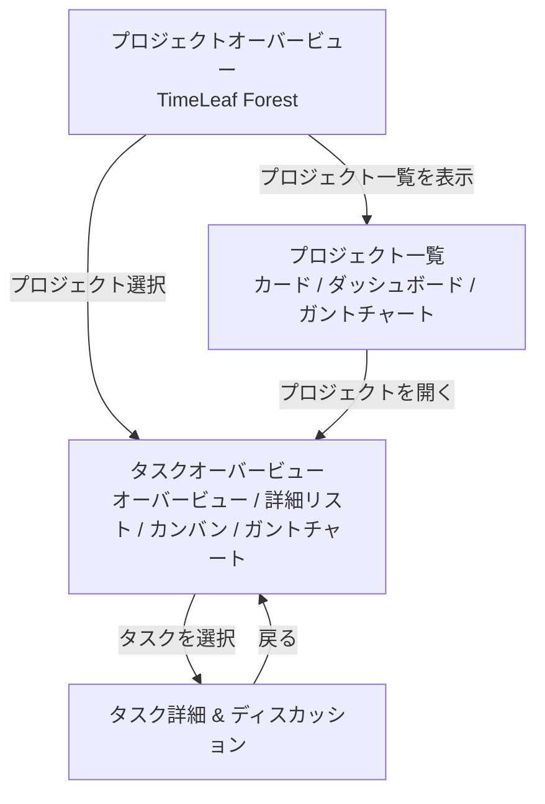

# 画面設計・画面遷移図

## 1. コンセプト

TimeLeafの画面構成は、情報の解像度を段階的に高めていく「レイヤー構造」を採用する。
ユーザーは、全体を俯瞰する「エモーショナルな視点」から、個別のタスクを解決する「実務的な視点」までをシームレスに行き来できる。

## 2. 画面遷移図（レイヤー構造）

## 3. 各画面（レイヤー）の役割

### 3.1. プロジェクトオーバービュー (Top Page)

- **ビジュアルコンセプト**: 「Forest Evolution」
- **目的**: プロジェクト全体の健全性、成長、歴史の可視化（エモーショナルな俯瞰）。
- **主要機能**:
  - 現在進行中プロジェクトの成長（樹木）表示
  - アーカイブ済みプロジェクトの蓄積（背景の森）表示
  - 最終同期日、データ鮮度の直感的な把握

### 3.2. プロジェクト一覧 (Project List)

- **目的**: 複数のプロジェクトを並列で管理・比較し、次に着手すべきプロジェクトを特定する。
- **表示切り替え**:
  - **カード・グリッド型**: 概要と進捗を視覚的に把握。
  - **ダッシュボード案**: 工数、予算、ヘルスステータスを計数的に把握。
  - **ガントチャート**: 複数のプロジェクト間の期間の重なりを把握。

### 3.3. タスクオーバービュー (Project Workspace)

- **目的**: 特定プロジェクト内の具体的なタスク管理。
- **表示切り替え**:
  - **オーバービュー**: プロジェクトの進捗率、マイルストーン、ボトルネックの把握。
  - **詳細リスト**: 高密度なタスク一覧、一括操作。
  - **カンバン**: 状態のドラッグ&ドロップ管理。
  - **ガントチャート**: タスク間の依存関係とスケジュール管理。

### 3.4. タスク詳細 & ディスカッション

- **目的**: 1つのタスクに対する深い理解と、チーム間の非同期コミュニケーション。
- **主要機能**:
  - タスクのMarkdownによる詳細記述
  - コメント（蓄積型データ）によるディスカッション
  - 添付ファイル、関連タスクのポインタ管理
  - 実績工数の入力
