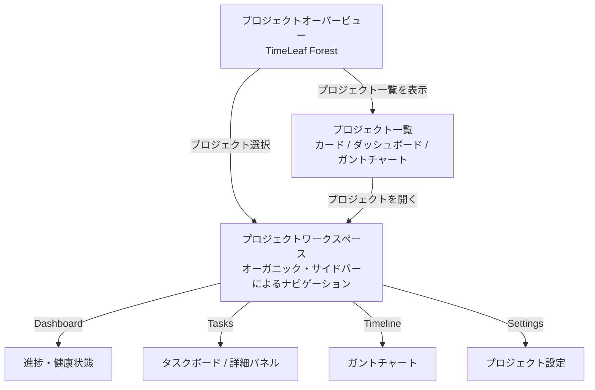

# 画面設計・画面遷移図

## 1. コンセプト

TimeLeafの画面構成は、情報の解像度を段階的に高めていく「レイヤー構造」を採用する。
ユーザーは、全体を俯瞰する「エモーショナルな視点」から、個別のタスクを解決する「実務的な視点」までをシームレスに行き来できる。

## 2. 画面遷移図（レイヤー構造）

## 3. 各画面（レイヤー）の役割

### 3.1. プロジェクトオーバービュー (Top Page)

- **ビジュアルコンセプト**: 「Forest Evolution」
- **目的**: プロジェクト全体の健全性、成長、歴史の可視化（エモーショナルな俯瞰）。
- **主要機能**:
  - 現在進行中プロジェクトの成長（樹木）表示
  - アーカイブ済みプロジェクトの蓄積（背景の森）表示
  - 最終同期日、データ鮮度の直感的な把握

### 3.2. プロジェクト一覧 (Project List)

- **目的**: 複数のプロジェクトを並列で管理・比較し、次に着手すべきプロジェクトを特定する。
- **表示切り替え**:
  - **カード・グリッド型**: 概要と進捗を視覚的に把握。
  - **ダッシュボード案**: 工数、予算、ヘルスステータスを計数的に把握。
  - **ガントチャート**: 複数のプロジェクト間の期間の重なりを把握。

### 3.3. プロジェクトワークスペース (Project Workspace)

特定プロジェクトの深化を担当するレイヤー。効率的なナビゲーションと「樹」の成長を感じさせるオーガニックなデザインを融合させる。

- **サイドバーナビゲーション**:
  - 折りたたみ可能な「幹」としてのメニュー。
  - プロジェクト間の移動ではなく、プロジェクト内の「視点」を切り替える。
- **構成コンポーネント**:
  - **Dashboard**: プロジェクトの健康状態を愛でる画面。成長ビジュアルとサマリー統計。
  - **Tasks**: 実務画面。リスト/カンバンの切り替えと、スライド式の詳細パネル。
  - **Timeline**: 計画俯瞰画面。柔らかい表現のガントチャート。
  - **Settings**: 根幹設定。名称変更やアーカイブ処理。

### 3.4. タスク詳細パネル (Task Detail)

1つのタスクに対する深い対話を担当する。

- **目的**: チーム内の非同期コミュニケーション（ディスカッション）と属性の精緻化。
- **主要機能**:
  - 吹き出し形式のコメント履歴。
  - 目的（Roots）の提示と詳細編集。
  - 依存関係の視覚化と設定。
