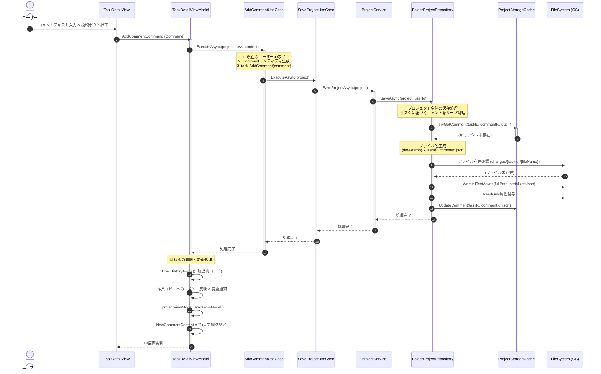
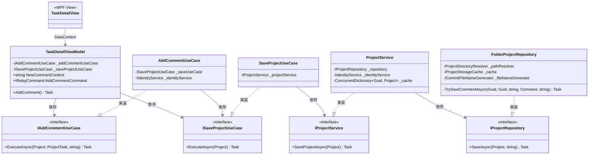

# 詳細設計書：タスクコメント投稿・保存フロー

本ドキュメントは、TimeLeaf アプリケーションにおけるタスク詳細画面（`TaskDetailView`）からコメントを投稿し、ローカルストレージ（フォルダベースの変更履歴システム）へ永続化されるまでの一連の処理フローを定義します。

---

## 1. 処理フロー全体像（シーケンス図）

以下は、ユーザーが画面からコメントを入力して「投稿」ボタンを押下してから、物理ファイルとして保存され、画面が更新されるまでのシーケンス図です。



---

## 2. クラス構成と関係性

コメント投稿および永続化に関与する主要なコンポーネントのクラス図です。



---

## 3. 各コンポーネントの詳細仕様

### 3.1. UI層 (`TaskDetailView` & `TaskDetailViewModel`)

- **ソースファイル**:
  - `TaskDetailView.xaml`: [TaskDetailView.xaml](file:///C:/Users/kiddy/OneDrive/Git/TimeLeaf/src/TimeLeaf/Views/Workspace/TaskDetailView.xaml)
  - `TaskDetailViewModel.cs`: [TaskDetailViewModel.cs](file:///C:/Users/kiddy/OneDrive/Git/TimeLeaf/src/TimeLeaf/ViewModels/Workspace/TaskDetailViewModel.cs)
- **処理概要**:
  - ユーザー入力値 `NewCommentContent` の変更時に `AddCommentCommand` の実行可能状態 (`CanExecute`) が再評価されます。内容が空または空白のみの場合は投稿ボタンが無効化されます。
  - コマンド実行（`AddComment()`）時は、作業用コピー（編集中の仮状態）ではなく、**マスターモデル（`_projectViewModel.Model` / `_taskViewModel.Model`）** に対して直接ユースケースを適用します。
  - ユースケース完了後、作業用コピーにもコメントを反映して UI への即時反映を図り、最後にテキストボックスをクリアします。

### 3.2. ユースケース層 (`AddCommentUseCase` & `SaveProjectUseCase`)

- **ソースファイル**:
  - `AddCommentUseCase.cs`: [AddCommentUseCase.cs](file:///C:/Users/kiddy/OneDrive/Git/TimeLeaf/src/TimeLeaf/UseCases/AddCommentUseCase.cs)
  - `SaveProjectUseCase.cs`: [SaveProjectUseCase.cs](file:///C:/Users/kiddy/OneDrive/Git/TimeLeaf/src/TimeLeaf/UseCases/SaveProjectUseCase.cs)
- **処理概要**:
  - `AddCommentUseCase` は `IIdentityService` を使用して現在サインインしているユーザーの ID を取得し、それを `AuthorId` とする `Comment` エンティティを生成します。
  - 生成されたコメントを `task.AddComment(comment)` でタスクに紐づけた後、`SaveProjectUseCase` を呼び出し永続化処理を連鎖させます。

### 3.3. サービス層 (`ProjectService`)

- **ソースファイル**:
  - `ProjectService.cs`: [ProjectService.cs](file:///C:/Users/kiddy/OneDrive/Git/TimeLeaf/src/TimeLeaf/Services/ProjectService.cs)
- **処理概要**:
  - プロジェクトをリポジトリへ保存する際、`IIdentityService.CurrentUserId` を操作ユーザー文字列として `IProjectRepository.SaveAsync(project, userId)` へ引き渡します。
  - 保存成功後、オンメモリキャッシュ (`_cache`) の情報を更新し、他コンポーネントへ更新を知らせる `ProjectUpdated` イベントを発火します。

### 3.4. リポジトリ層・ストレージ永続化 (`FolderProjectRepository`)

- **ソースファイル**:
  - `FolderProjectRepository.cs`: [FolderProjectRepository.cs](file:///C:/Users/kiddy/OneDrive/Git/TimeLeaf/src/TimeLeaf/Repositories/FileSystem/FolderProjectRepository.cs)
- **処理概要**:
  - プロジェクトフォルダ内の `changes/` フォルダ配下に、アトミックな増分ファイルとして情報を書き込みます（ADR-0001仕様）。
  - **コメント保存処理 (`TrySaveCommentAsync`)**:
    1. **キャッシュチェック**: `ProjectStorageCache` に該当コメントが存在するかを検証。
    2. **ファイル名生成**: `ICommitFileNameGenerator` を用いて、`{作成日時}_{ユーザーID}_comment.json` という命名規則で一意なファイル名を決定。
    3. **重複防止**: 物理ファイルが既に存在する場合は保存処理をスキップ。
    4. **シリアライズと物理保存**: `CommentDto` に詰め替えてシリアライズし、`File.WriteAllTextAsync` で保存。
    5. **書き込み保護**: 保存完了後にファイル属性を `ReadOnly` に設定して、誤った上書きを防止。
    6. **キャッシュ更新**: キャッシュ状態を最新化。

---

## 4. 物理データ構造 (DTO仕様)

保存されるコメントの JSON ファイルは、以下の DTO クラス (`CommentDto`) に基づいてシリアライズされます。

```csharp
public record CommentDto(
    Guid Id,
    Guid TaskId,
    Guid AuthorId,
    string Content,
    List<string> AttachmentLinks
);
```

### 保存先パスの例

```text
[データ保存先ルート]/[ProjectID_ProjectName]/changes/[TaskID]/[yyyyMMddHHmmss]_[UserID]_comment.json
```
