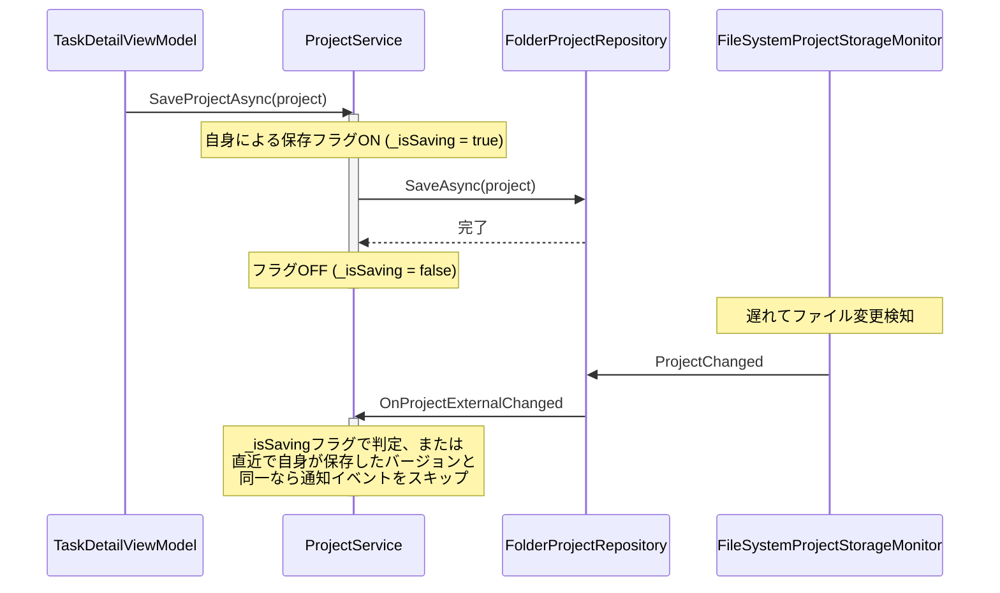

# 対策提案書：自身の操作によるストレージ更新通知の抑止

自身がコメントを投稿した（ストレージに保存された）際にも外部変更検知（`HasExternalChange = true`）が動作してしまう課題に対し、MVVM、クリーンアーキテクチャ、およびリアクティブ設計の観点からアプローチを比較検討し、最適な対策案を提案します。

---

## 1. 現状の課題と原因分析

現在、自身がコメントを投稿した際にも「他ユーザーによる更新」と判定される原因は以下の2点です。

1. **ファイルシステム監視（FileSystemWatcher）のタイミング問題**:
   - `FileSystemProjectStorageMonitor` は `MarkFileAsJustWritten(fileName)` で自身が書き込んだファイルを一時的に無視しますが、ファイル書き込み完了時と `SetAttributes`（ReadOnly属性付与）による複数回の OS イベントが時差で発生するため、一部の変更イベントが無視時間をすり抜けて「外部変更」として検知されてしまいます。
2. **差分検知ロジック（ProjectDiffService）の不足**:
   - リロードされたデータとキャッシュデータの差分を計算する [ProjectDiffService](file:///C:/Users/kiddy/OneDrive/Git/TimeLeaf/src/TimeLeaf/Services/ProjectDiffService.cs) において、コメントの増加判定が「純粋なコメント数の増加」のみで判定されており、「追加されたコメントの投稿者（`AuthorId`）が自分自身（`currentUserId`）であるか」が考慮されていません。

---

## 2. 対策案の比較検討

### 対策案A：データ駆動型アプローチ（推奨）

**【概要】**
[ProjectDiffService](file:///C:/Users/kiddy/OneDrive/Git/TimeLeaf/src/TimeLeaf/Services/ProjectDiffService.cs) の差分判定ロジックを拡張し、「増えたコメントの作成者が自分以外であること」を判定条件に加えます。

- **実装イメージ**:

  ```csharp
  // コメントチェック
  var oldCommentIds = oldTask?.Comments.Select(c => c.Id).ToHashSet() ?? new HashSet<Guid>();
  var newCommentsFromOthers = newTask.Comments
      .Where(c => !oldCommentIds.Contains(c.Id) && c.AuthorId != currentUserId);

  if (newCommentsFromOthers.Any())
  {
      newCommentTaskIds.Add(newTask.Id);
  }
  ```

- **メリット**:
  - **タイミング問題の完全な排除**: OSのファイルI/O遅延などに一切依存せず、ドメインモデルの状態（データ）のみで正しく判定可能。
  - **クリーンアーキテクチャの遵守**: ビジネスルール（「他人が書いた新規コメントのみを通知する」）がドメインサービス層にカプセル化される。
- **デメリット**: なし。

---

### 対策案B：サービス層のセッション・コンテキスト制御アプローチ

**【概要】**
`ProjectService` にて自身が保存処理を実行している間（アクティブなセッション中）は、外部変更通知のイベント発行を一時的に保留・抑制します。

- **シーケンスイメージ**:



- **メリット**: コメントに限らず、タスク情報の書き込みなど「自分自身が行ったすべての保存処理」に対する外部検知を一元的に抑制できる。
- **デメリット**: 非同期のファイルI/O完了を待つ必要があり、フラグの寿命管理（セマフォやロック）が複雑になる。

---

### 対策案C：MVVM層での一時的なイベント購読解除

**【概要】**
`TaskDetailViewModel` が `AddComment` を実行する間だけ、`ProjectUpdated` イベントの購読を解除します。

- **メリット**: 最も局所的な修正で済む。
- **デメリット**:
  - ファイルI/Oの非同期書き込みと `FileSystemWatcher` の検知には遅延があるため、メソッドを抜けて再購読（`+=`）した後にイベントが遅れて到達する可能性があり、通知を完全に防げない（タイミングハザード）。
  - 各 ViewModel で同じボイラープレートコードを書く必要があり、保守性が低い。

---

## 3. 推奨する対策方針

設計の一貫性と安定性の観点から、**「対策案A（データ駆動型アプローチ）」**の採用を強く推奨します。

```mermaid
classDiagram
    class ProjectDiffService {
        +CalculateDiff(oldProject, newProject, currentUserId) ProjectDiff
    }
    Note for ProjectDiffService "追加されたコメントの AuthorId が\ncurrentUserId 以外のもののみを\nNewCommentTaskIds に追加するようロジックを修正"
```

### 期待される効果

- コメント投稿処理において、自身が書き込んだコメントは `diff.NewCommentTaskIds` に含まれなくなります。
- その結果、`ProjectService` 内で `NotificationRequested` や `ProjectUpdated` などの不要なイベント発火が抑止され、`TaskDetailViewModel` の `HasExternalChange` が誤って `true` になる問題が根本的に解決します。
