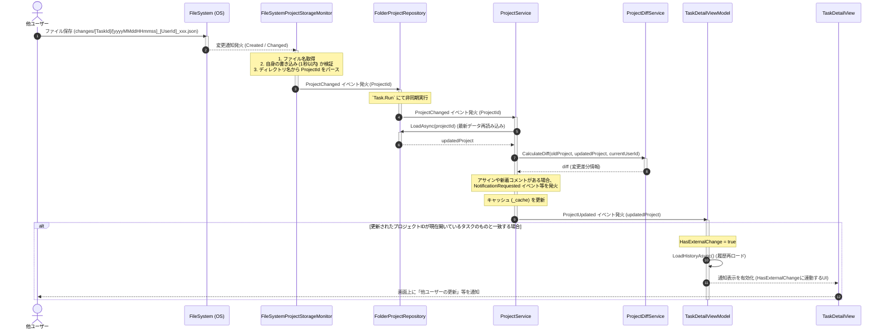
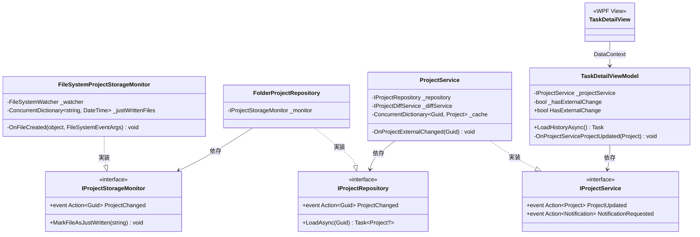

# 詳細設計書：外部変更検知および画面通知フロー

本ドキュメントは、他ユーザーなどの外部要因によってストレージ（ファイルシステム）上のタスク・プロジェクト情報が更新された際に、アプリケーションがそれを検知し、タスク詳細画面（`TaskDetailView`）へ通知および同期を行うまでの一連の処理フローを定義します。

---

## 1. 処理フロー全体像（シーケンス図）

以下は、ファイルシステムに変更が発生してから、画面へ通知バーが表示され、履歴がリロードされるまでのシーケンス図です。

---

## 2. クラス構成と関係性

外部変更の監視、イベント伝播、UI同期に関与するコンポーネントのクラス図です。

---

## 3. 各コンポーネントの詳細仕様

### 3.1. 変更監視層 (`FileSystemProjectStorageMonitor`)

- **ソースファイル**:
  - `FileSystemProjectStorageMonitor.cs`: [FileSystemProjectStorageMonitor.cs](file:///C:/Users/kiddy/OneDrive/Git/TimeLeaf/src/TimeLeaf/Repositories/FileSystem/FileSystemProjectStorageMonitor.cs)
- **処理概要**:
  - `FileSystemWatcher` を用いて、データ保存用ベースディレクトリ配下の `*.json` ファイルの更新（`NotifyFilters.FileName | NotifyFilters.LastWrite`）を再帰的に監視します。
  - 自身によるファイル書き込み時の変更検知ループを防ぐため、`MarkFileAsJustWritten` に登録されたファイル名かつ直近1秒以内の更新イベントは無視します。
  - 変更検知したファイルのパス構造（例: `[ProjectId_ProjectName]/changes/...`）を解析し、ディレクトリの先頭部分からプロジェクトIDを抽出します。
  - 正常にパースできた場合、`ProjectChanged` イベントを呼び出します。

### 3.2. リポジトリ層 (`FolderProjectRepository`)

- **ソースファイル**:
  - `FolderProjectRepository.cs`: [FolderProjectRepository.cs](file:///C:/Users/kiddy/OneDrive/Git/TimeLeaf/src/TimeLeaf/Repositories/FileSystem/FolderProjectRepository.cs)
- **処理概要**:
  - 内部で保持する `IProjectStorageMonitor` の `ProjectChanged` イベントを購読します。
  - 監視イベントを捕捉すると、スレッドブロッキングを避けるため `System.Threading.Tasks.Task.Run` にてスレッドプール上で自身の `ProjectChanged` イベントを非同期的に発火させます。

### 3.3. サービス層 (`ProjectService`)

- **ソースファイル**:
  - `ProjectService.cs`: [ProjectService.cs](file:///C:/Users/kiddy/OneDrive/Git/TimeLeaf/src/TimeLeaf/Services/ProjectService.cs)
- **処理概要**:
  - リポジトリの `ProjectChanged` イベントからプロジェクトIDを受け取り、`OnProjectExternalChanged` メソッドを起動します。
  - リポジトリから変更後の最新プロジェクト情報を再ロード（`LoadAsync`）します。
  - `IProjectDiffService` を使用して、旧プロジェクトと更新後プロジェクトの差分を比較します。
    - 自身以外のユーザーによる「タスク担当のアサイン（自分宛て）」や「新しいコメントの追加」を検知した場合、システムトースト等の通知イベント `NotificationRequested` を発火します。
  - ローカルのオンメモリキャッシュ（`_cache`）を最新に差し替え、`ProjectUpdated` イベントを発火します。

### 3.4. ViewModel・UI層 (`TaskDetailViewModel` & `TaskDetailView`)

- **ソースファイル**:
  - `TaskDetailViewModel.cs`: [TaskDetailViewModel.cs](file:///C:/Users/kiddy/OneDrive/Git/TimeLeaf/src/TimeLeaf/ViewModels/Workspace/TaskDetailViewModel.cs)
  - `TaskDetailView.xaml`: [TaskDetailView.xaml](file:///C:/Users/kiddy/OneDrive/Git/TimeLeaf/src/TimeLeaf/Views/Workspace/TaskDetailView.xaml)
- **処理概要**:
  - ViewModel コンストラクタで、`ProjectService.ProjectUpdated` イベントを購読します。
  - 更新されたプロジェクトIDが、現在開いているタスクが所属するプロジェクトIDと一致する場合、以下のアクションを取ります。
    1. プロパティ `HasExternalChange` を `true` に設定します。
       - これによって UI 側（`TaskDetailView`）で「他ユーザーによる変更があります。最新データを読み込みますか？」等の確認バーが連動して表示されます。
    2. 変更履歴表示を同期するため、`LoadHistoryAsync()` を非同期で呼び出して履歴一覧（コメント以外の変更点）を再描画します。
